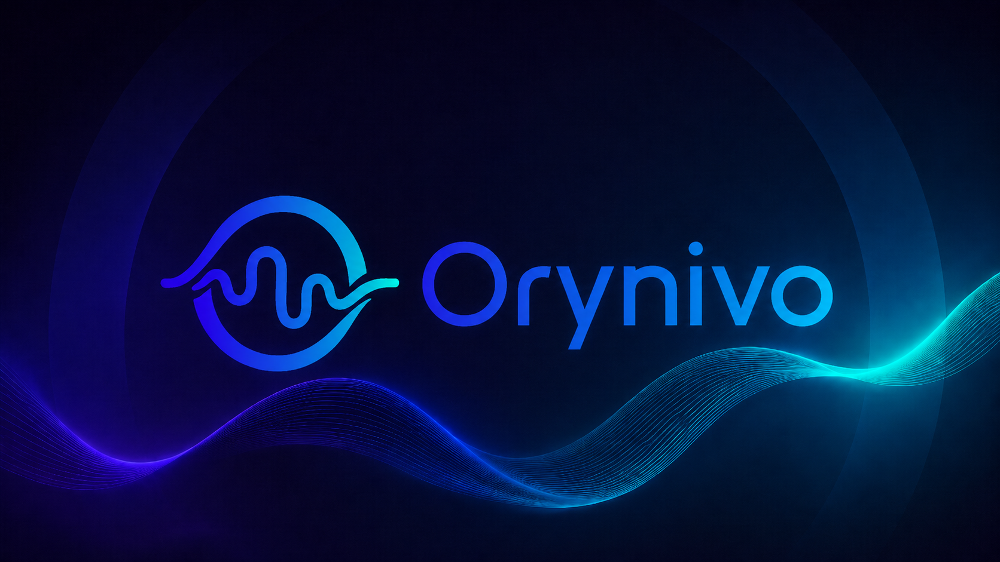

<p align="center">
  
</p>

# Orynivo

An Avalonia desktop music library for Windows, Linux, and macOS, plus a
cross-platform music server for local Hi-Fi libraries.

**Official website:** [orynivo.app](https://orynivo.app/) ·
**Documentation:** [GitHub Wiki](https://github.com/bschlaack/Orynivo/wiki) ·
**Downloads:** [Latest release](https://github.com/bschlaack/Orynivo/releases/latest)

cwASIO/Steinberg ASIO/WASAPI · DSD/DSF/DFF · Gapless Playback · ReplayGain ·
Parametric EQ
Plex · Radio · Podcasts · AI Chat · MCP Server · Network Streaming

## Why Orynivo?

Orynivo is for people who still own and manage a local music library and want a
modern Windows, Linux, or macOS player with serious audio output support — and
the ability to reach that library from any device on the local network.

- Bit-perfect/native DSD playback through direct ALSA on Linux without a native
  bridge, or through cwASIO/the optional Steinberg ASIO bridge on Windows
- Exclusive WASAPI, cwASIO, and Steinberg ASIO output profiles
- Classic AirPlay (RAOP) output profiles with automatic receiver discovery on
  Windows, Linux, and macOS
- Gapless playback
- CUE sheet support
- ReplayGain and parametric EQ
- Local library, playlists, smart playlists and full-text search
- Unified artist detail pages with an album-style image-and-biography hero,
  synchronized favorites, image management, refreshable biographies, and
  combined local/Orynivo Server albums. Their cards include cover search,
  favorites, and local/server source badges, and a source-aware track table below them lists
  the artist's tracks ordered by album and track number. Manual biography refresh can use an
  editable external lookup name without changing the library artist name
  while the artist's albums render before profile loading and remain available
  throughout it; profile text follows German, English, French, or Spanish
- Hierarchical Genre Cloud with source-aware track and album recommendations
  across the local library and connected Orynivo Servers, backed by a subtle
  cached grayscale mosaic of matching artist images
- Infinite Mix, which turns recent listening habits and favorites into a
  continuously replenished mixed-source queue
- Album-artist-centered library attribution: explicit `ALBUMARTIST` metadata
  wins, untagged multi-artist compilations are grouped under `Various Artists`,
  featured track credits do not create extra library artists, and embedded
  MusicBrainz artist IDs unify verified spelling variants
- Optional curated Fanart.tv artist thumbnails. Enter a personal key under
  Settings > Artist information, or set the `FANART_TV_API_KEY` environment
  variable before starting Orynivo. Entered keys are stored in Orynivo's
  encrypted current-user credential container. Manual artist images always
  take priority. The same Settings section can fill missing artist images in
  the local library and every configured Orynivo Server sequentially, trying
  Fanart.tv first when a key is available and Wikimedia Commons as the fallback.
  With a configured Fanart.tv key, the review dialog can automatically accept
  Fanart.tv results for the remainder of the run. Wikimedia candidates always
  remain subject to individual acceptance or rejection, and the complete run
  can be cancelled from the review dialog. Manual image searches from artist
  information use an editable query and the same Fanart.tv-first, Wikimedia-
  fallback order. The batch displays progress and an estimated remaining time
- Unified local and Orynivo Server artist browsing: matching artists appear once
  in Artists and search, and every artist link opens one combined album view
  across those libraries regardless of which source the clicked item came from.
  Renaming a unified artist applies the new name to its matching local identity
  and to its matching artists on every reachable configured Orynivo Server;
  local merge-priority choices are applied to equivalent server collisions.
  Cached biographies and images are shared across matching identities, and new
  profile downloads or manual image selections are synchronized to each source.
  Opening a unified artist or album also fills missing artwork in either the
  local library or matching reachable Orynivo Servers from an existing counterpart.
- AI control via local LLMs, LM Studio/Ollama/OpenAI-compatible endpoints
- MCP server for external AI assistants
- **Orynivo Server** — headless cross-platform music server (Linux, macOS, Windows)
  that exposes the same library over the local network via REST and HTTP streaming

[](LICENSE)

## Product website

The official website is available at [orynivo.app](https://orynivo.app/). Its
self-contained responsive source lives in [`html/`](html/). It
defaults to English, can switch to German, French, or Spanish, and includes
current application screenshots, feature and installation guides, and download
links that resolve through GitHub's latest public release API. See
[`html/README.md`](html/README.md) for local preview and publishing notes.

The Windows desktop includes cwASIO/Steinberg ASIO and WASAPI playback. The
Linux desktop is a separately packaged player with direct ALSA hardware profiles
for exact-rate PCM and native DSD output without resampling, alongside an OpenAL
system route through PipeWire, PulseAudio, or ALSA. It supports FFmpeg-decoded
local files, remote streams, CUE/MKA segments, gapless queues, seeking,
ReplayGain, PCM boost, and the parametric equalizer. The macOS desktop provides
the same library, streaming, playlist, radio, podcast, AI Chat, MCP, and PCM
processing features through the system OpenAL output path on Intel and Apple
Silicon. Native DSD output remains available only through Windows ASIO/cwASIO
or Linux direct ALSA, and Windows System Media Transport Controls remain
Windows-specific.

AirPlay output profiles discover local `_raop._tcp` receivers on every desktop
platform. On Windows, the bundled native `AirPlay2Bridge` is preferred and
performs transient pairing, encrypted ALAC transport, unicast PTP timing, and
receiver-requested RTP retransmission. This path has been verified with clean
audible playback on a Sonos stereo pair. Playback is decoded to 44.1 kHz stereo
PCM; volume and ReplayGain are applied before it reaches the native bridge.
If the bridge is unavailable, Orynivo falls back to a compatible `raop_play`
executable beside Orynivo or on `PATH`. The helper is deliberately not bundled
because available RAOP implementations use licenses independent of Orynivo's
Apache-2.0 distribution. Gapless transitions and Orynivo's parametric equalizer
are not yet supported for either network path.

> **Experimental:** Native AirPlay 2 support is an interoperability
> implementation based on observed protocol behavior rather than a public Apple
> sender specification. Continuous playback, seeking, timing, and stereo-pair
> output have been verified with the tested Sonos receiver, but other receiver
> models, firmware versions, grouped configurations, and network environments
> may behave differently. Keep a conventional local output profile available
> and report reproducible receiver-specific problems with model and firmware
> information.

The Qt-free `AirPlay2Bridge` provides native AirPlay 2 support while retaining
the existing RAOP route for AirPlay 1 receivers. The evaluated
[`airplay2-sender-cpp`](https://github.com/akustikrausch/airplay2-sender-cpp)
project supplies the reusable Apache-2.0 cryptographic core fetched at a pinned
commit; its Qt sender is not linked. The native bridge fetches Apple's official
Apache-2.0 ALAC encoder separately.

Development of that component has started in
[`Native/AirPlay2Bridge`](Native/AirPlay2Bridge/README.md). It is deliberately a
standalone CMake project with a versioned C ABI and no dependency on Avalonia,
Orynivo, or Qt, so it can later be published and consumed independently. The
current milestone provides portable sockets, fail-closed transient pairing,
authenticated encrypted control, unicast gPTP timing, timing-peer registration,
session/audio-stream SETUP, official Apple ALAC support, partial-PCM buffering,
and encrypted realtime type-96 media over receiver-selected UDP ports.
Its PTP clock behavior follows a complete working iPhone-to-Sonos capture;
352-frame ALAC packets use a PTP/RTP synchronization anchor and bounded
retransmission. Captured type-103 TCP framing remains isolated for later AAC use.
Initial receiver volume, RTP-anchored DMAP metadata, encrypted teardown, and
PTP/buffered-packet diagnostics are included. These paths are backed by native
tests. Session negotiation, encrypted media, PTP timing, retransmission,
teardown, and clean audible playback are verified against a Sonos stereo-pair
receiver. The Windows build copies the bridge beside Orynivo and loads it
through its stable C ABI.

Settings > Playback offers mutually exclusive DSD routing preferences for
lossy DSD-to-PCM conversion and bit-perfect DSD over PCM (DoP). DoP requires a
DoP-capable DAC and an exact-rate output path; PCM volume, ReplayGain, boost,
and equalizer processing do not apply to the encapsulated DSD payload. The
Linux path supports local and Orynivo-Server-streamed stereo DSF and
uncompressed stereo DFF/DSDIFF through direct ALSA. When ALSA exposes the
native `DSD_U32_BE` hardware format, Orynivo sends bit-perfect DSD directly to
the DAC; otherwise it uses DoP as a fallback (for example a 176.4-kHz carrier
for DSD64). Neither Linux DSD path requires cwASIO, the Steinberg SDK, or an
Orynivo native bridge.

API keys and access tokens for Last.fm, Fanart.tv, AI Chat, Orynivo Server,
Plex, and streaming providers are kept out of `settings.json`. Orynivo stores
them in one current-user encrypted credential container: Windows uses
current-user DPAPI; Linux and macOS use AES-GCM with a separate random key file
restricted to the current operating-system user. Existing plaintext settings
and the older Windows Plex/streaming credential files are migrated automatically.

The application uses the Orynivo wordmark in the startup screen, sidebar, and
About dialog, plus a multi-resolution Windows application icon based on the
standalone logo.

> This project is under active development. The database schema, user
> interface, and available features may still change.

## Desktop builds

The desktop project selects its target from the build host:

- Windows builds target `net8.0-windows10.0.19041.0` and include the existing
  WASAPI/ASIO integrations.
- Linux builds target `net8.0`; PCM audio is rendered through direct ALSA or
  OpenAL, while
  Windows endpoint-volume and system-media integrations are replaced by
  compatibility services.
- macOS builds target `net8.0`; PCM audio is rendered through Apple's system
  OpenAL framework. Windows audio, endpoint-volume, and SMTC integrations are
  replaced by compatibility services, and native DSD output is not currently
  available.
- Linux output profiles expose OpenAL and direct exclusive ALSA as separate
  output types. OpenAL lists only PipeWire/system-routed devices; direct ALSA
  lists only `hw:` endpoints that require exclusive access. Selecting another
  desktop default output does not release a card that PipeWire still owns; its
  system sound-device profile must be disabled before direct ALSA can open it.
- The Linux target pins Tmds.DBus.Protocol 0.92.0 so D-Bus observer cleanup
  remains non-blocking while Avalonia's UI dispatcher is shutting down.

Build the Linux desktop with .NET 8:

```bash
dotnet restore Orynivo/Orynivo.csproj
dotnet build Orynivo/Orynivo.csproj --configuration Release
dotnet run --project Orynivo/Orynivo.csproj
```

Create the same self-contained `linux-x64` output produced by CI:

```bash
dotnet restore Orynivo/Orynivo.csproj --runtime linux-x64
dotnet publish Orynivo/Orynivo.csproj --configuration Release \
  --runtime linux-x64 --self-contained true --no-restore \
  --output artifacts/Orynivo-linux-x64
```

Version tags publish self-contained desktop releases for `linux-x64` and
`linux-arm64`. Each architecture receives a portable `.tar.gz`, a DEB package,
and an RPM package; Arch Linux additionally receives an
`x86_64 .pkg.tar.zst`. Installed packages place Orynivo under
`/usr/lib/orynivo`, add the `orynivo` command, and register a desktop launcher.
All Linux player artifacts are covered by the signed release manifest.

Build and publish the macOS desktop for either supported architecture:

```bash
dotnet restore Orynivo/Orynivo.csproj --runtime osx-arm64
dotnet publish Orynivo/Orynivo.csproj --configuration Release \
  --runtime osx-arm64 --self-contained true --no-restore \
  --output artifacts/Orynivo-osx-arm64
```

Use `osx-x64` instead on an Intel Mac. Tagged releases package both runtime
identifiers as self-contained installable PKGs, portable `Orynivo.app` ZIPs,
and tar archives. Orynivo detects FFmpeg and FFprobe in the normal Homebrew,
MacPorts, pkgsrc, Fink, and per-user binary locations even when it is launched
from Finder. If neither tool is installed, it downloads architecture-matching
builds into the Orynivo per-user cache. OpenAL is provided by macOS.

An X11 or Wayland desktop session is required to run the Avalonia UI. FFmpeg
and FFprobe must be installed and available on `PATH` for playback, media
probing, waveforms, ReplayGain analysis, and other FFmpeg-backed library
functions. Settings checks the platform-appropriate executable names through
the same locator used at startup. The ALSA runtime (`libasound.so.2`, commonly
packaged as `libasound2`)
is required for direct hardware output. The OpenAL runtime (`libopenal.so.1`,
commonly packaged as `libopenal1`) is required for the system/default route.

## AI Integration

Orynivo includes two complementary AI interfaces that share the same 23
player-control, queue-management, and library tools.

### Embedded AI Chat

The **KI-Chat** sidebar view connects to any OpenAI-compatible LLM endpoint —
[LM Studio](https://lmstudio.ai/), [Ollama](https://ollama.com/), OpenAI,
Anthropic (via compatibility layer), or any custom `/v1/chat/completions`
provider. No external configuration file or MCP server is required: tools are
dispatched directly inside the application.

Responses stream token by token. The model calls tools autonomously — asking
*"Spiele alle Beatles-Alben"* makes it search the library, fill the queue with
the results, and start playback, all in one turn.

Configure the endpoint URL, optional API key, model name, and max-token limit
under **Settings → Integration → KI-Chat/AI Chat**. LM Studio and Ollama work
without an API key.
The sidebar entry can be shown or hidden independently under
**Settings → Appearance**, without disabling or deleting the saved AI Chat
configuration.

**Available tools:**

| Category | Tools |
| --- | --- |
| State | `get_now_playing`, `get_queue`, `get_current_time` |
| Playback | `play`, `pause_resume`, `next_track`, `previous_track`, `stop`, `seek`, `set_volume` |
| Queue | `queue_append`, `queue_play_next`, `clear_queue`, `replace_queue` |
| Library | `search_library` |
| Playlists | `list_playlists`, `get_playlist_tracks`, `create_playlist`, `create_smart_playlist` |
| History | `get_play_history` |
| Web | `search_web`, `fetch_page`, `fetch_page_as_markdown` |

The model picks the right queue tool automatically: `replace_queue` clears the
old list and starts playing immediately when the user asks for new content;
`queue_append` adds to the existing queue when the user wants to add more;
`clear_queue` empties the queue without interrupting the current track.
Library search includes configured Orynivo Server libraries as opaque
`orynivo://serverId/track/trackId` references. Playback and queue tools resolve
those references inside the app, so API keys and authenticated stream URLs are
not exposed to the model.

### MCP Server

The same 23 tools are available as an embedded **Model Context Protocol (MCP)**
HTTP/SSE server for external AI assistants such as
[Claude Desktop](https://claude.ai/download). Enable it under
**Settings → Integration → MCP Server**, choose a port (default **49200**),
and point your assistant at `http://localhost:49200/mcp`. The server binds to
`localhost` only. Each of the 23 tools has an individual enable/disable toggle
in Settings so you can limit what an external assistant is allowed to do. The
web tools (`search_web`, `fetch_page`, `fetch_page_as_markdown`) route through
the MCP server, not the model directly: searches use a configurable SearXNG
instance and page fetches are hardened against SSRF (http/https only, private/
loopback addresses blocked, response size/redirect/timeout limits, no arbitrary
downloads, request logging). Configure the SearXNG URL and limits under
**Settings → Integration → MCP Server → Web browsing**.

## Orynivo Server

`Orynivo.Server` is a self-contained headless music server that runs on
**Windows, Linux, and macOS**. It scans the same local library directories and
exposes them over the local network so any HTTP client — another Orynivo
instance, a media player, or a custom app — can browse and stream your music.

### API

All endpoints except `/api/health` require a pre-shared API key sent either as
an `X-Api-Key` header or a `?key=` query parameter. The query-parameter form
works directly in FFmpeg and browser URLs.

| Endpoint | Description |
| --- | --- |
| `GET /api/health` | Status — no authentication required |
| `GET /api/info` | Server name, version, and configured library paths |
| `GET /api/settings/library-paths` | Configured library root paths |
| `PUT /api/settings/library-paths` | Replace configured library root paths, persist them, refresh watchers, and start a scan |
| `GET /api/files/directories?path=` | Browse server-side directories for remote path selection |
| `POST /api/scan` | Trigger a full library scan |
| `POST /api/scan/metadata` | Re-read metadata from every supported file, including timestamp-unchanged files |
| `GET /api/library/backup` | Download a versioned ZIP backup of the server library and artwork caches |
| `PUT /api/library/backup` | Validate and restore a server library backup (maximum 2 GiB) |
| `GET /api/scan` | Scan status with current root, processed/total counts, current file, last result, errors, and `LibraryChangedAt` for client cache invalidation |
| `GET /api/artists` | All artists (id, name, favorite, biography/image flags) |
| `GET /api/artists/{id}` | Complete artist metadata, including cached biography/source fields |
| `POST /api/artists/{id}/profile` | Store client-refreshed artist biography/source fields and optional image bytes |
| `POST /api/artists/{id}/rename` | Rename one artist or merge it with a matching artist |
| `GET /api/artists/{id}/albums` | Albums for one artist |
| `GET /api/albums` | All albums (id, title, display artist, year, artwork paths) |
| `GET /api/albums/{id}` | One album without loading the complete album catalog |
| `GET /api/albums/{id}/tracks` | Track list for one album |
| `GET /api/tracks` | Paginated track list (`?page=0&pageSize=500`) |
| `GET /api/tracks/{id}` | Full metadata for one track |
| `GET /api/tracks/{id}/waveform` | Cached compact waveform peak data for the transport progress view |
| `GET /api/tracks/{id}/lyrics` | Cached plain/synced lyrics for one track |
| `PUT /api/tracks/{id}/lyrics` | Store client-downloaded lyrics on the server |
| `GET /api/tracks/facets` | Lightweight facet rows (genre, format, bitrate) for the Tracks filter |
| `GET /api/genres/cloud` | Compact hierarchical genre counts and bounded recommendation candidates |
| `GET /api/library/summary` | Aggregate album, track, artist, and favorite counts without materializing library rows |
| `POST /api/tracks/by-ids` | Track rows for a list of track IDs (facet-filtered results) |
| `GET /api/folders/tracks` | Lightweight track rows plus playback metadata for building a server library folder tree |
| `GET /api/artwork/album/{id}?size=96` | Album artwork thumbnail or original image |
| `PUT /api/artwork/album/{id}` | Store raw client-selected album artwork bytes on the server |
| `GET /api/artwork/artist/{id}` | Artist image stored on the server |
| `PUT /api/artwork/artist/{id}` | Store raw client-selected artist image bytes on the server |
| `GET /api/playlists` | All playlists (regular and smart) |
| `GET /api/playlists/{id}/tracks` | Resolved track list (smart playlists are evaluated live) |
| `POST /api/playlists/{id}/resolve` | Resolve a smart playlist while applying client-side favorite track IDs |
| `POST /api/playlists/resolve-count` | Return the match count for ad-hoc smart-playlist criteria |
| `POST /api/playlists` | Create a regular playlist from server-side track IDs |
| `POST /api/playlists/smart` | Create a smart playlist from criteria |
| `PUT /api/playlists/{id}/smart` | Update a smart playlist name and criteria |
| `POST /api/playlists/{id}/tracks` | Append server-side track IDs to a regular playlist |
| `DELETE /api/playlists/{id}` | Delete a playlist on the server |
| `DELETE /api/playlist-tracks/{id}` | Remove one entry from a server playlist |
| `GET /api/search?q=` | Full-text search — returns matching tracks |
| `GET /api/search/full?q=` | Category search — returns tracks, albums, and artists |
| `GET /api/stream/{trackId}` | Byte-range HTTP streaming for regular files; FLAC transcode for CUE virtual tracks |
| `GET /api/stream/path?p=` | Stream by absolute file path |
| `GET /api/artwork/album/{id}?size=` | Album artwork (`size=96` or `size=320` for thumbnails) |
| `GET /api/artwork/track?p=` | Track artwork by file path |
| `GET /api/artwork/track/{id}?size=` | Track artwork by track ID (`size=96` or `size=320` for thumbnails) |

### Configuration

Edit `appsettings.json` before first use:

```json
{
  "Orynivo": {
    "ServerName": "Orynivo Server",
    "ApiKey": "change-this-to-a-long-random-string",
    "LibraryPaths": ["/music", "/mnt/nas/music"],
    "ScanOnStartup": true,
    "CalculateMissingReplayGainDuringScan": false,
    "ReplayGainFfmpegThreads": 1,
    "ReplayGainDelayMilliseconds": 250,
    "AllowRemoteUpdates": false
  }
}
```

`CalculateMissingReplayGainDuringScan` defaults to `false`. Embedded ReplayGain
tags are still imported, while expensive FFmpeg analysis is skipped during
normal discovery scans. Enabling it can substantially lengthen scans of large
or chaptered files such as complete-concert MKA containers.
Server ReplayGain work defaults to one FFmpeg worker thread and a cancellable
250 ms pause between analysed tracks. Packaged Linux services also use reduced
CPU and I/O priority so SSH and API traffic remain responsive. Set
`ReplayGainFfmpegThreads` to `0` to restore FFmpeg's automatic thread choice;
both limits can be overridden through `/etc/default/orynivo-server` with the
usual `Orynivo__...` environment-variable names.
ReplayGain maintenance keeps only compact album identifiers between its track
and album phases and refreshes the search index in bounded batches, so memory
usage remains proportional to a small work set rather than the complete library.

`AllowRemoteUpdates` is disabled by default. When enabled on a packaged Linux
server, an authenticated Orynivo desktop client can download the matching signed
DEB/RPM release, relay it to a server without internet access, and request its
installation. The server verifies the signed manifest and package hash again;
the unprivileged server process only stages the files. A narrowly scoped root
systemd updater performs the package-manager operation and restarts the service.
Automated DEB upgrades retain the existing administrator-edited
`/etc/orynivo-server/appsettings.json` without prompting.
Release builds normalize and validate the packaged Bash maintainer scripts so
DEB installation cannot fail because of Windows CRLF shebang line endings.
Portable, development, Windows, and macOS server installations currently report
managed updates as unsupported.

The server binds to `http://0.0.0.0:5280` by default. Override the port in
`appsettings.json` under `Kestrel:Endpoints:Http:Url`.

When the Windows player is connected to an Orynivo Server, the server's music
directories can also be managed from the Orynivo Server connection dialog in
Settings → Library → Orynivo Server. The directory browser shows the server
filesystem, not the local Windows filesystem: Unix-like servers open at `/`,
while Windows servers expose their drive roots. The same dialog can start a
normal incremental server scan or explicitly re-read metadata from every file,
and shows live progress while large directories are being scanned. The metadata
refresh is slower because it bypasses timestamp-based skipping, but it does not
modify the audio files and retains confirmed library-only metadata corrections.
Track favorites and artist profiles remain untouched; when corrected tags create
a replacement album identity in the same physical directory, downloaded album
artwork and the album favorite flag are carried forward as well.
Inaccessible subdirectories such as Linux `lost+found` folders are skipped
instead of aborting the complete scan.
Configured Orynivo Server connections are merged into the main Artists, Albums,
Tracks, and search-result library views. Rows from a server are marked with an
optional `OS` source badge that shows the server name as a tooltip.
The same connection dialog can download or restore a complete server-library
backup. It includes the SQLite database, playlists, history, album artwork,
artist images, and configured server directory list. Audio files and API keys
are never included. Restore validates the ZIP before replacing data, rebuilds
the search index, and leaves the original library in place if installation fails.
The shared Folder structure view is also available with server-only
configurations; a local library directory is not required to browse folders
reported by an Orynivo Server.
The Windows client probes server compatibility in Settings, reports missing
newer endpoints explicitly, shows the last successful connection time when a
server is unreachable, and can clear cached remote artwork, track lists, and
folder trees per server or globally.

### Running the server

**dotnet:**

```bash
dotnet run --project Orynivo.Server/Orynivo.Server.csproj
```

**Linux (after package install):**

```bash
# Edit config first
sudo nano /etc/orynivo-server/appsettings.json

# Enable and start the service
sudo systemctl enable --now orynivo-server

# Check logs
journalctl -u orynivo-server -f
```

FFmpeg must be installed separately on Linux and macOS and is required only for
CUE-sheet track transcoding. Regular audio files are served directly via
byte-range streaming without FFmpeg.

## Features

- Playback through direct ALSA or OpenAL on Linux, and through cwASIO, the
  optional Steinberg ASIO bridge, or exclusive-mode WASAPI on Windows
- Classic AirPlay playback through automatically discovered RAOP receivers on
  Windows, Linux, and macOS when a compatible `raop_play` helper is installed
- Automatic PCM down-conversion through `ffmpeg` when the source sample rate
  exceeds the selected ASIO or WASAPI device's capabilities; WASAPI uses the
  highest supported 32-bit float, 24-bit PCM, or 16-bit PCM output format
- Native stereo DSD playback for local and Orynivo-Server-streamed DSF and
  uncompressed DFF files. Linux uses the kernel/ALSA `DSD_U32_BE` interface
  directly, with DoP fallback and no cwASIO/Steinberg/native bridge dependency;
  Windows uses cwASIO or the optional Steinberg ASIO bridge. Remote streams are
  read incrementally through HTTP byte ranges.
- Real-time DSF/DFF-to-PCM conversion for playback through WASAPI, with the
  active conversion and PCM sample rate shown in the transport and status bar
- Optional forced DSF/DFF-to-PCM conversion with cwASIO or Steinberg ASIO,
  allowing volume, ReplayGain, and the parametric equalizer to affect DSD
  sources
- Optional +6 dB PCM output boost for users whose DAC plays native DSD
  noticeably louder than PCM. The boost applies only to PCM playback paths;
  native DSD remains bit-perfect.
- PCM playback through `ffmpeg`
- Multiple named output profiles for quickly switching between configured
  output devices; a quick-pick popup in the transport bar selects the active
  profile without opening Settings. On first start, Orynivo creates and selects
  a `Default` WASAPI profile from the Windows default multimedia output device
  when no output has been configured yet.
- A lock button beside the transport Equalizer and Output quick-pickers can
  close the active exclusive player and release its audio device for another
  application. Orynivo preserves the source and playback position; selecting
  the open lock reacquires the device and resumes playback without restarting
  the application.
- Seeking, volume control, pause, and an editable persistent **Up next** queue
  with play-next/append actions, drag-and-drop from track, album, and folder
  views, removal, reordering, complete clearing, restore-last-queue, playlist
  saving, and shuffle without repeating a track within the currently loaded
  queue. The queue is stored in the SQLite library database instead of the JSON
  settings file.
- Optional fade transitions can smooth queue advances that are not already
  handled by the gapless PCM engine.
- The transport progress control shows a waveform-style peak view for local
  audio files and remote Orynivo Server tracks, caches compact peak data, and
  keeps click/drag seeking on the same timeline. Remote tracks first use the
  server waveform endpoint and fall back to local FFmpeg analysis of the
  authenticated stream URL when the server cannot analyse the source format.
- Remote Orynivo Server tracks keep their library title, artist, album, and
  duration in transport metadata, play history, and **Up next**. Authenticated
  `?key=` stream URLs are not shown as titles and are not persisted in the
  playback queue.
- Configured Orynivo Server libraries are included in the same Artists, Albums,
  Tracks, and search-result infrastructure as the local library. Server rows
  reuse the local table/artwork masks and show an optional `OS` source badge
  with the server name as tooltip. To avoid Avalonia DataGrid stalls, mixed
  local/server rows are loaded into the combined row set before the first table
  bind instead of replacing an already-visible table while the user scrolls.
  Remote artwork is loaded lazily from authenticated server artwork endpoints
  and cached in the Windows client's local data directory.
- The Tracks filter includes a **Source** section with Local and every
  configured Orynivo Server. Saved smart playlists can store the same source
  restriction through stable source keys (`local`, `server:<id>`).
- Remote Orynivo Server artist-info pages support renaming/merging artists and
  assigning Wikimedia artist images. The Windows client performs the image
  search and uploads the selected image to the server. For a unified artist,
  biographies and images are synchronized with the matching local and other
  reachable Orynivo Server identities while manual images remain protected.
- Album and artist detail headers also accept JPEG, PNG, or WebP files selected
  from the local device. Uploaded covers and artist images are stored in the
  owning local or Orynivo Server cache; adjacent trash actions remove them.
  Unified artist-image uploads and deletions are applied to every matching
  reachable library identity.
- Opening a remote server album from a selected artist initially scopes the
  album tracks to that artist, with the same checkbox used by local albums to
  show every track on the album.
- Opening any local or remote album from a unified artist view retains that
  album's source-specific artist identity, initially scopes the track list to
  the selected artist, and offers the checkbox to show all album tracks.
- Album views, Dashboard recommendations, and Recently Added displays combine
  local and Orynivo Server records with the same artist and album title into one
  source-aware logical album (`L+OS` when both contribute). When matching tags
  occur in several physical folders
  (for example an original release, a sampler, and a hi-res collection), the
  detail view retains every track and presents each folder as a separate
  edition group; similarly named tracks are never silently deduplicated.
  Untitled or explicitly unknown albums are omitted from album-card/catalog
  surfaces because they cannot be identified usefully; their tracks remain
  available through Tracks, folders, playlists, and track search.
  Album database records without any remaining indexed tracks are also omitted
  from local and Orynivo Server catalogs, detail views, recent lists, and
  aggregate counts.
  Artwork cards show the complete album title in a tooltip when the visible
  card label is shortened to fit.
- File and directory context menus in an Orynivo Server Folder structure view
  can append tracks to an existing mixed playlist or create a new shared local
  playlist. Folder descendants are stored as stable `orynivo://` references;
  authenticated playback URLs are never written as playlist entries.
- Playlists live under the Library sidebar and can contain mixed local and
  Orynivo Server tracks. Server tracks are stored in local playlists as stable
  `orynivo://` references and resolved to authenticated stream URLs only when
  they are opened or queued, so `?key=` stream URLs are not persisted.
  Playlist tables show the favorite heart first and the source column next to
  it. Smart playlists resolve against the combined local and configured
  Orynivo Server track set.
- Remote Orynivo Server artists, albums, and tracks can be marked as favorites;
  those favorite flags are stored only in the Windows client's settings.
- Remote Orynivo Server album covers and artist images can be searched from the
  Windows client; the client uploads the selected image bytes to the server, and
  the server stores them in its own artwork cache.
- Remote Orynivo Server artist biographies can be refreshed from the Windows
  client. Last.fm or Wikipedia requests run on the client; the server receives
  only the resulting biography, source URL, language, and optional image bytes
  to cache.
- Windows System Media Transport Controls integration with global media keys,
  play/pause/previous/next/stop and seek requests, system-overlay and lock-screen
  metadata, album art, playback state, and timeline synchronization
- Optional ReplayGain volume adjustment for PCM playback, using track or album
  gain metadata with fallback to the other available value; native DSD output
  remains bit-perfect. A small transport badge appears when ReplayGain is active
  for the current PCM track. Automatic FFmpeg calculation of missing ReplayGain
  values during scans is optional and disabled by default; embedded tags are
  always imported, and missing values can still be calculated manually.
- Multiple named parametric PCM equalizers with one selected profile, a live
  frequency-response graph, editable preamp, dynamic filter rows, persisted
  on/off state, and Equalizer APO/AutoEQ text-profile import. Preamp, peak,
  low/high shelf, low/high pass, and `GraphicEQ` profiles are supported;
  changes are crossfaded during playback and native DSD output remains
  bit-perfect
- SQLite music library with multiple monitored directories
- CUE-sheet support for large FLAC/WAV images: indexed CUE entries appear as
  independent virtual tracks in library, folder, search, queue, playlist, and
  playback-history workflows while retaining the shared physical audio file
- Automatic recursive library monitoring with debounced create, update, rename,
  and delete handling, plus periodic full reconciliation as a safety net
- Metadata and embedded artwork extraction through TagLibSharp
- Artist, album, track, and folder views
- Resizable table columns whose widths are preserved separately for each
  library, search, playlist, Plex, radio, podcast, and history table
- Context-sensitive column selection by right-clicking a table header, including
  optional technical and tag metadata for local tracks and appropriate catalog
  fields for radio and podcasts
- Drag-and-drop table-column ordering persisted independently for each table
  and main-content view
- Space-saving accordion sections in the main sidebar, with configurable
  visibility and persisted independent expansion for library, personal radio,
  podcast, and playlist sections; the Internet Radio, Podcasts, and
  **Up Next** sidebar items can each be hidden independently in Settings
- Subtle interface motion for navigation and browsing: sidebar accordion rows
  fade/collapse, Dashboard and library view changes fade in briefly, artwork
  cards expose a lightweight hover overlay, and longer content loads use a
  compact skeleton/progress state instead of a static blank/loading view.
- Linked artist and album names for direct navigation to artist albums and
  album tracks
- Session-wide Back navigation across sidebar views, search results, dashboard
  links, artist/album drill-downs, playlists, podcasts, radio, folders, and Plex
  library views. Mixed local/Orynivo Server artist and album views remain
  unified when restored, including source-aware selection when IDs overlap
- Conservative artist-name normalization for `feat.` credits and unambiguous
  case, accent, spacing, and punctuation variants, with a repair action for
  existing libraries
- A physical-folder-based metadata review catches albums fragmented by bad tags,
  missing or duplicate numbering, and inconsistent album artists. It can match
  a folder from Settings > Library > Review metadata against MusicBrainz by
  editable album/artist search terms, title similarity, and all available
  approximate track durations, then apply a
  confirmed release as persistent library-only metadata without rewriting files.
- Live A-Z/# quick navigation beside alphabetically sorted artist, album, and
  track lists
- Artist and album views with table and virtualized artwork modes, including
  Favorites-only filtering in both modes
- Interactive count-scaled genre cloud with hierarchical drill-down and
  listening-history-based track suggestions, aggregated across the local
  library and every configured Orynivo Server; recommendations can be viewed
  as playable tracks or as album artwork cards. Its curated graph supports
  genres with multiple parents, while unknown tags remain discoverable by
  their real names under **More genres**. Opening a suggested album uses the
  full album detail view; Back returns to the previous cloud level and mode.
  Cloud counts and label sizes represent tracks in Tracks mode and distinct
  albums in Albums mode.
- Infinite Mix builds a continuously replenished Up Next queue from recent
  listening habits, favorites, the local library, and all reachable Orynivo
  Servers. It balances discovery with genre affinity and suppresses immediate
  track, album, and artist repetition. Initial preparation is surfaced through
  a progress overlay; later refills rotate through the complete matching genre
  population and happen automatically in the background.
- Dashboard with an artwork-backed greeting hero with a lightened-artwork rim, live
  library counters (including local and configured Orynivo Server track
  favorites), random
  playback and queue shortcuts, parallel Recently Played/Recently Added artwork
  strips, album links plus source and favorite state on history cards, a period-aware listening
  seven-point labeled and smoothed listening-trend chart, compact proportional
  genre/album/artist analytics, history-based album recommendations with
  period and mood selectors plus a persisted List/animated cover-stage view,
  quick access, and a
  clickable playback calendar. Album rankings retain artwork, and linked genres
  open the matching filtered track list.
- Dashboard performance investigations can use the bounded rolling
  `logs/dashboard-performance.log` beneath the Orynivo data directory. It
  contains only phase names, elapsed times, build outcome, and server count;
  library paths, media names, URLs, and credentials are never recorded.
  Expensive album catalog aggregates use a short in-memory snapshot across
  repeated Dashboard visits; overlapping loads are coalesced, and local or
  remote library-version changes invalidate the snapshot automatically.
- The last selectable sidebar view is restored on restart, including Genre
  Cloud, Dashboard, AI Chat, playlists, saved radio/podcast entries, Orynivo
  Server views, and Plex libraries. Missing or removed entries fall back to
  Tracks.
- Clickable populated calendar days with a modal daily listening history;
  local title, album, and artist links open the corresponding library view,
  and title links immediately start playback
- Internet radio search through the free Radio Browser directory, direct
  playback, persistent personal stations in the sidebar, station logos, and
  live ICY title/artist metadata when supplied by the stream. Radio ICY updates
  and locally cached station logos are also pushed to the Windows media overlay.
- Multi-select genre filtering for radio search results using normalized
  station tags, with filter options built from the complete Radio Browser tag
  statistics rather than the first result page; selecting a genre runs a new
  server-side station query
- Podcast search through the public Apple Podcasts catalog, complete RSS/Atom
  episode lists sorted newest first, persistent pinned podcasts in the sidebar,
  category and feed-language filters, played/in-progress state, and automatic
  resume from the saved position
- Podcast detail cards with large artwork, feed description and metadata, and
  total, unheard, and started episode statistics
- A transport info view for the currently playing podcast episode with centered
  podcast artwork, publication data, duration, genre, and RSS summary
- Radio and podcast filter catalogs are shown before a search; after entering a
  search term, filter options and counts are recalculated from that result set
- Podcast category and language filters can be used without entering a title
- Lucene.NET full-text search with partial-word and German umlaut variants
- Favorites for tracks, albums, and artists
- Regular playlists and live smart playlists with metadata, library-age,
  playback-history, ordering, and result-limit criteria
- Smart playlists are created directly from active track filters and can be
  refined later through their sidebar context menu. The editor previews the live
  match count while criteria are changed, including unified local/server counts
  and server-side counts when the connected Orynivo Server supports them.
- UTF-8 M3U8 import and export for regular playlists, including relative local
  paths, retained missing-file entries, and HTTP/HTTPS streams; credentialed
  Plex URLs are excluded
- Gapless sequential PCM playback through cwASIO, Steinberg ASIO, and exclusive
  WASAPI: the next FFmpeg decoder is prefetched and handed to the existing output
  session without reopening the audio device
- Theme-aware table highlighting follows the currently audible track across
  library, search, playlist, radio, podcast, and Plex views
- Back navigation restores the previous selection and scroll position in album
  and artist table or artwork views after returning from a drill-down
- Double-clickable artist and album artwork cards also expose their primary
  names as direct links to the same detail view.
- Album cover changes and artist metadata/image updates retain the current
  selection and list position
- Album track details provide an in-place favorite button and artist-info action
  alongside the album metadata. Album identity uses album title plus physical
  album root, so equal titles stored in different album folders have independent
  list entries, covers, and favorites. Compilations remain together, and conventional
  `CD1`/`CD2` or `Disc 1`/`Disc 2` subfolders appear as separate groups inside
  one multi-disc album detail view. Disc tables expand fully without their own
  scrollbars, and row selection does not move the outer page.
- Opening a compilation from an artist keeps the full album header visible,
  initially filters its tracks to that artist, and provides a switch to show
  every track across all assigned discs. Physical directory/disc headings are
  shown only when the current result contains multiple groups.
- Playback history for local tracks, podcast episodes, and internet-radio
  sessions, including position and completion state
- Artwork downloads through the Cover Art Archive and manual MusicBrainz
  search, preserving stylized punctuation in the primary query and falling back
  to punctuation-normalized variants
- Embedded or downloaded lyrics with synchronized LRC highlighting during playback
- Manual LRCLIB lyrics search with editable title and artist, result preview,
  and explicit replacement of the cached lyrics
- Cached artist images and localized biographies from Wikipedia/Wikimedia
- Manual Wikimedia Commons artist-image search with editable search text
- Manually selected artist images are retained across profile refreshes, renames,
  and artist merges
- Artist renaming in the artist information view, including a transactional
  merge flow with an explicit choice of which artist profile to retain
- ZIP export and import for the managed library, playlists, personal radio
  stations, pinned podcasts, history, artwork, and configured library directories
- Modern light and dark themes with neutral surfaces, a shared accent resource,
  cover-derived transport accents, and refined sidebar/table/transport styling
- Shared vector icons for compact symbol buttons, clearer empty states for
  missing local libraries, servers, radios, and podcasts, plus a mini context
  menu on the now-playing cover for opening the album/artist, searching cover
  art, and toggling the favorite state
- Gradient hover outlines for interactive artwork cards, source-appropriate
  vector icons throughout the main sidebar (including a matching orange vector
  lightning icon for smart playlists), and smoothly arrow-controlled
  20-item carousels for Recently Played and Recently Added; their arrows sit in
  the section header beside Show all instead of covering artwork, and unavailable
  directions stay in place as muted controls so the header never shifts
- Edge-aligned equal-size Dashboard overview cards and a listening chart with
  daily short-period points, readable sparse date labels, and a rounded Y-axis
  ceiling above the curve peak; hovering any point shows its date and listened
  minutes, while bounded curve smoothing keeps the plotted height proportional
  to that Y-axis scale without overshooting measured values
- Dashboard favorite totals match the unified Favorites view by counting only
  currently resolvable local and Orynivo Server tracks
- Persistent personal 1–5-star ratings for local and Orynivo Server tracks,
  editable directly in shared track tables. An optional MusicBrainz rating
  column shows cached community scores and vote counts; lookups prefer embedded
  recording MBIDs and conservatively match artist, title, and duration only
  when exactly one recording remains. Personal ratings are weighted strongly
  in Infinite Mix, with community ratings used as a smaller secondary signal.
  Album detail pages automatically refresh missing or stale MusicBrainz track
  ratings in the background; cached results remain valid for 30 days and the
  requests are serialized to respect MusicBrainz service limits. A uniquely
  resolved artist/title/duration fallback persists its recording MBID. Ratings
  themselves use direct recording lookups: MusicBrainz supports identifier
  searches in batches, but those search results do not reliably carry community
  ratings and therefore cannot safely replace one lookup per recording.
  Duplicate local and server rows with the same recording MBID nevertheless
  share one lookup result, avoiding redundant requests for mirrored libraries.
  A track that has not yet been queried shows the larger **Load rating** action;
  temporary album-refresh failures are retried up to three times and then show
  **Try again**. A completed lookup without community votes is shown as
  **Not rated**, so transient failures are not confused with a confirmed empty
  rating.
  The same direct lookup also caches curated MusicBrainz genres and community
  tags with at least two positive votes. They remain separate from embedded
  genres but supplement Genre Cloud classification, genre filters, Infinite Mix,
  and full-text search. Normal scans never contact MusicBrainz or rewrite files.
  During active music playback, Orynivo continues this enrichment in one
  rate-limited background queue for the local library and configured Orynivo
  Servers. Pausing or stopping playback pauses the queue; opening an album or
  explicitly requesting a rating takes priority. Known recordings refresh
  after 30 days, while unresolved artist/title matches wait 90 days before a
  retry so ambiguous metadata does not generate repeated requests.
- German, English, French, and Spanish user interfaces
- Multiple Plex Media Server configurations with protected access tokens and
  music-library discovery, artist/album/track browsing, folder navigation, and
  playback, including an A–Z root-folder index and multi-part tracks decoded as
  one logical item
- Provider-neutral streaming interfaces with a prepared Qobuz configuration
  page for future approved partner API access
- Embedded **MCP server** (Model Context Protocol) that, when enabled under
  Settings > Integration, exposes 23 player, queue, playlist, history, library,
  and controlled web-browsing tools to any MCP-compatible AI assistant (e.g.
  Claude Desktop). Tools can be individually enabled or disabled, the server
  binds to `localhost` only, and the TCP port is configurable (default 49200).

### Genre discovery and Infinite Mix

Open **Genre Cloud** from the Library section to explore the genres found in
the local library and every configured Orynivo Server. The first level groups
the library into broad families. Selecting a label reveals its more specific
genres and immediately updates the recommendations below the cloud. The
breadcrumb buttons return to an earlier level. A leaf without further children
remains visible as the large center label instead of producing an empty view.
The **Start Infinite Mix from cloud** action opens the normal profile editor
with the genres represented at that level already selected. After confirmation,
Orynivo queries the selected branch and every recursive subgenre directly,
including tracks tagged with the parent genre itself; on a leaf level, only
that selected genre is used.

The selector above the recommendations changes both the result presentation and
the numbers in the cloud:

- **Tracks** shows playable, source-aware track suggestions. Counts and label
  sizes represent matching tracks.
- **Albums** shows artwork cards. Counts and label sizes represent distinct
  matching albums. Double-clicking a card opens the normal album detail page;
  Back restores the selected genre, mode, selection, and scroll position.

Unknown or unusually specific tags are retained under **More genres** rather
than being collapsed into a generic Other bucket. Suggestions use listening
history when available, but the cloud remains usable with a new or empty play
history. Remote results retain their owning server for playback, favorites,
artwork, and album/artist navigation.

Resolved cloud levels are retained in a bounded in-memory session cache. After
the first load, reopening the root or one of the recently visited branches
reuses its merged taxonomy and source-aware recommendations instead of querying
and resolving every library again. Local file-watcher changes and newer remote
server library versions invalidate these entries automatically; the cache is
never persisted, and its identity contains neither server URLs nor credentials.

The current level uses available images from its recommended local and remote
artists as a muted grayscale tile background. Images are proportionally fitted
inside their tiles so portraits and landscape artwork remain complete. Orynivo
caches only the rendered mosaic for 24 hours; authenticated server artwork URLs
are never stored in that Genre Cloud cache. The generated backgrounds can be
cleared independently under **Settings > Appearance** without removing
downloaded artist images or other artwork. In the same section, the background
can be disabled entirely or switched between album covers and artist images.
If only a few matching images are available,
Orynivo centers that set instead of repeating it across the complete surface.
The number of requested tiles follows the current cloud width (up to 32), while
a perceptual image fingerprint removes duplicate pictures even when local and
server copies use different files or encodings. Sparse sets automatically use
larger tiles: one row receives the complete background height and divides the
available width only among its actual images, without cropping or distortion.
The same Appearance block stores a 0–100% image-visibility slider, defaults it
to 50%, and provides the independent background-cache clear action.

**Infinite Mix** can be started from the Dashboard, **Up next**, or the current
Genre Cloud level. Before
starting, its compact profile editor selects a calm, balanced, or energetic
mood; familiar-to-adventurous discovery level; 3, 7, 30, or 90-day history
period; local and individual Orynivo Server sources; favorite and rarely-played
weighting; and optional included or excluded genres. Initial creation shows a
blocking progress overlay so the start action cannot be mistaken for an
unresponsive button. The first 20 tracks are added to Up next; another batch is
prepared automatically in the background when five tracks remain. Existing
queue entries and immediate track, album, and artist repetitions are avoided.
Selection prefers different artists and albums first, then fills the batch with
additional eligible tracks when a narrow genre contains too few distinct albums
to reach the normal 20-track batch size.
Genre rules use removable chips with type-ahead suggestions gathered from the
currently enabled local and Orynivo Server libraries; custom genre text remains
possible when a library does not offer a matching suggestion.

While the mix is active, Up next shows a persistent active/paused status and
actions to pause or resume replenishment, adjust the profile, replace the next
suggestion, request more or less music like a selected suggestion, or exclude a
track from future mixes. The profile, genre feedback, and credential-free local
or server track exclusions are persisted in `settings.json`.

## Supported Formats

The user interface recognizes, among others:

`DSF`, `DFF`, `FLAC`, `MP3`, `WAV`, `AIFF`, `M4A`, `MKA` (Matroska Audio),
`AAC`, `OGG`, `Opus`, `WMA`, and CUE sheets referencing PCM source files such
as FLAC or WAV.

PCM formats are decoded by `ffmpeg`, which Orynivo downloads automatically on
Windows into `%LOCALAPPDATA%\Orynivo\ffmpeg` on first start if not already
installed. The Windows downloader resolves the current BtbN LGPL ZIP asset from
the GitHub release API so it is not tied to one fixed archive name. Actual codec
support depends on the build.
MKA files containing Matroska chapters are expanded into individually
searchable and playable library tracks. Chapter title, artist, album, album
artist, genre, year, track number, and time boundaries are read through
`ffprobe`; the physical MKA is not shown as an additional whole-file track. An
MKA without usable chapters remains one ordinary library track.
MKA chapter probing limits FFprobe's analysis window and times out after 30
seconds per file so damaged or slow network media cannot block a complete scan.
Library-only title corrections for virtual chapters are persisted separately in
SQLite and survive later scans without changing the MKA container.
For CUE sheets, Orynivo uses `INDEX 01` boundaries to seek and stop FFmpeg
within the referenced source file; no temporary split files are created.
When WASAPI is selected, DSD audio in DSF or DFF containers is converted to PCM
in real time without creating a temporary file. When cwASIO or the optional
Steinberg ASIO backend is selected, DSF and uncompressed stereo DFF can be sent
as native DSD when the driver reports compatible DSD support; otherwise Orynivo
can fall back to the same FFmpeg-backed DSD-to-PCM path. On Linux, DSF and
uncompressed stereo DFF are sent directly through ALSA as native
`DSD_U32_BE`, with DoP as the fallback when the DAC supports it; no ASIO bridge
is involved. PCM and converted DSD are output at the highest supported endpoint
sample rate that does not exceed the source rate; if the endpoint exposes only
higher rates, its lowest supported rate is used. Unsupported sample rates and
bit depths are converted by `ffmpeg`.

## Requirements

### Windows player

- Windows 10 or Windows 11, x64
- [.NET 8 SDK](https://dotnet.microsoft.com/download/dotnet/8.0) (for building)
- [FFmpeg](https://ffmpeg.org/) — downloaded automatically on first start if not
  already present. To use a specific build, place `ffmpeg.exe` and `ffprobe.exe`
  in `PATH`, next to `Orynivo.exe`, or in `%LOCALAPPDATA%\Orynivo\ffmpeg`.
- For cwASIO: Visual Studio 2022 with the **Desktop development with C++**
  workload and an installed ASIO driver
- Optional Steinberg bridge: Steinberg ASIO SDK 2.3

The MIT-licensed cwASIO sources are included under `third_party/cwasio`, so the
normal build provides ASIO support without the Steinberg SDK. The Steinberg
ASIO SDK is not included in the repository. The build script accepts its
location through `-AsioSdkDir` or the `ASIO_SDK_DIR` environment variable. It
also checks `third_party\asiosdk`, `external\asiosdk`, and, for compatibility
with older development environments, `C:\Dev\asiosdk_2.3`. When no SDK is
found, only **cwASIO** is offered. When the SDK is available, Settings offers
both **Steinberg ASIO** and **cwASIO**.

### Linux player

- Linux x86-64 or ARM64 with an X11 or Wayland desktop
- FFmpeg and FFprobe available on `PATH`
- ALSA runtime (`libasound.so.2`) for direct PCM, native DSD, and DoP output
- OpenAL runtime (`libopenal.so.1`) for the optional system-routed output
- A DAC/ALSA endpoint advertising `DSD_U32_BE` for native DSD, or a DoP-capable
  DAC for fallback playback

The Linux player does not build or load `AsioBridge.dll` or `CwAsioBridge.dll`.
Native DSF and uncompressed DFF output is sent directly through ALSA, so neither
the Steinberg ASIO SDK nor a platform-specific Orynivo bridge is required.

### macOS player

- macOS 10.15 or newer on Apple Silicon (`arm64`) or Intel (`x64`)
- FFmpeg and FFprobe from `PATH`, common package-manager locations, or Orynivo's
  automatic per-user download
- The system OpenAL framework used for PCM output
- Avalonia OpenGL rendering with a software fallback for Macs whose Metal
  shader compiler exceeds Skia's compilation timeout
- No ASIO, cwASIO, ALSA, or native DSD support

Tagged releases provide self-contained PKG installers and portable app bundles,
so the .NET runtime is not required. Development builds require the .NET 8 SDK.
The signed update mechanism selects and verifies the PKG matching the running
architecture before opening the normal macOS Installer.

### Orynivo Server

- Linux, macOS, or Windows; x64 or ARM64
- [.NET 8 SDK](https://dotnet.microsoft.com/download/dotnet/8.0) (for building;
  not required when using a self-contained release package)
- [FFmpeg](https://ffmpeg.org/) — recommended for CUE-sheet track transcoding
  (Debian/Ubuntu: `apt install ffmpeg`; Fedora/Rocky: install from RPM Fusion)
- Artwork thumbnail generation uses the bundled SkiaSharp native Linux assets;
  ImageMagick or other external image conversion tools are not required.
- No ASIO drivers or Windows dependencies

## Download

Download the latest builds from [Releases](https://github.com/bschlaack/Orynivo/releases).

### Windows player

| Package | Description |
| --- | --- |
| `Orynivo-{version}-win-x64-Setup.exe` | Installer — Start Menu entry and uninstaller |
| `Orynivo-{version}-win-x64-Portable.zip` | Portable — extract anywhere and run `Orynivo.exe` |

Both packages are self-contained (.NET 8 bundled, no prerequisites).

### Linux player

| Package | Description |
| --- | --- |
| `Orynivo-{version}-linux-x64.tar.gz` | Portable x86-64 archive |
| `Orynivo-{version}-linux-arm64.tar.gz` | Portable ARM64 archive |
| `orynivo_{version}_amd64.deb` / `orynivo_{version}_arm64.deb` | Debian / Ubuntu |
| `orynivo-{version}-1.x86_64.rpm` / `orynivo-{version}-1.aarch64.rpm` | Fedora / Rocky / RHEL |
| `orynivo-{version}-1-x86_64.pkg.tar.zst` | Arch Linux x86-64 |

The Linux packages are self-contained with respect to .NET. FFmpeg, ALSA, and
OpenAL remain system runtime dependencies as described above.
Tagged release builds validate that the Arch archive contains its required
root-level `.PKGINFO` metadata before publishing it.

The signed desktop updater detects Debian-family, RPM-family, and Arch-family
distributions. After verifying the selected package digest it requests
administrator authorization through PolicyKit and installs it with the native
package manager. CachyOS is treated as Arch Linux and receives the signed
`.pkg.tar.zst` package; the package file itself is never launched as an
executable. Orynivo remains open until the privileged package manager exits and
closes only after a successful installation. Authentication cancellation or a
package-manager error leaves the update window open with a failure status.

### macOS player

| Package | Description |
| --- | --- |
| `Orynivo-{version}-osx-arm64.pkg` | Installer for Apple Silicon Macs |
| `Orynivo-{version}-osx-x64.pkg` | Installer for Intel Macs |
| `Orynivo-{version}-osx-arm64-Portable.zip` | Portable app for Apple Silicon Macs |
| `Orynivo-{version}-osx-x64-Portable.zip` | Portable app for Intel Macs |
| `Orynivo-{version}-osx-arm64.tar.gz` | Alternative app archive for Apple Silicon |
| `Orynivo-{version}-osx-x64.tar.gz` | Alternative app archive for Intel |

The PKG installs `Orynivo.app` under `/Applications`. The bundle includes the
native Orynivo application icon. For portable use, extract
the ZIP and open `Orynivo.app` from any writable directory. The builds are
self-contained with respect to .NET; FFmpeg and FFprobe are found in common
package-manager locations or downloaded automatically when absent. The current
packages are not code-signed or notarized, so macOS Gatekeeper may require
explicitly opening the app or installer from Finder's context menu.

Orynivo's startup and About-window update checks support both Mac
architectures. They select the matching PKG from the signed release manifest,
verify its SHA-256 digest, and open it in the macOS Installer. Installation
still requires the normal explicit macOS confirmation; Orynivo never invokes a
privileged installation command itself.

### Linux server

| Package | Architecture |
| --- | --- |
| `orynivo-server_{version}_amd64.deb` | Debian / Ubuntu (x86-64) |
| `orynivo-server_{version}_arm64.deb` | Debian / Ubuntu (ARM64 / Raspberry Pi) |
| `orynivo-server-{version}-1.x86_64.rpm` | Fedora / Rocky / RHEL (x86-64) |
| `orynivo-server-{version}-1.aarch64.rpm` | Fedora / Rocky / RHEL (ARM64) |

All packages are self-contained (.NET 8 bundled). See the
[Server section](#orynivo-server) for post-install setup.

## Build

Clone the repository:

```powershell
git clone https://github.com/bschlaack/Orynivo.git
cd Orynivo
```

### Windows player

Create a debug build:

```powershell
.\build.ps1
```

The script builds the native x64 cwASIO bridge, optionally builds the Steinberg
bridge, and then builds the .NET application. It discovers Visual Studio through
`vswhere.exe` and falls back to `MSBuild.exe` from `PATH`.

Paths can be supplied without modifying project files:

```powershell
.\build.ps1 -AsioSdkDir 'D:\SDKs\asiosdk_2.3'
.\build.ps1 -Configuration Release
.\build.ps1 -Configuration Release -SkipAsio
.\build.ps1 -Configuration Release -SkipAsio -SkipCwAsio
.\build.ps1 -Configuration Release -SkipAirPlay2Bridge
```

For a persistent local setup, set `ASIO_SDK_DIR`. MSBuild discovery can
similarly be overridden with `-MSBuildPath` or `MSBUILD_EXE_PATH`.
`-RequireAsio` makes a missing Steinberg SDK fail the build. `-SkipAsio`
disables only the Steinberg bridge; `-SkipCwAsio` disables cwASIO.
The default build also compiles and tests the independent Qt-free
`Native/AirPlay2Bridge` transport milestone. `-SkipAirPlay2Bridge` skips that
native project for a focused managed/ASIO build; the incomplete bridge is not
copied into the desktop output.

### Orynivo Server

The server has no native dependencies and builds on any platform:

```bash
dotnet build Orynivo.Server/Orynivo.Server.csproj
dotnet run --project Orynivo.Server/Orynivo.Server.csproj
```

To publish a self-contained binary for a specific platform:

```bash
# Linux x64
dotnet publish Orynivo.Server/Orynivo.Server.csproj \
  --runtime linux-x64 --self-contained true --output out/linux-x64

# Linux ARM64
dotnet publish Orynivo.Server/Orynivo.Server.csproj \
  --runtime linux-arm64 --self-contained true --output out/linux-arm64
```

### Release builds (GitHub Actions)

The CI and release workflows use the Node.js 24 generations of GitHub's
checkout/.NET setup actions and the GitHub Release upload action.

Pushing a version tag triggers two parallel release workflows:

```powershell
git tag v0.14.0
git push origin v0.14.0
```

| Workflow | Runner | Output |
| --- | --- | --- |
| `release.yml` | Windows | `Orynivo-{v}-win-x64-Setup.exe`, `Orynivo-{v}-win-x64-Portable.zip` |
| `player-macos-release.yml` | macOS | Intel/Apple-Silicon PKGs, portable ZIPs, and tar archives |
| `server-release.yml` | Ubuntu | `amd64`/`arm64` `.deb` and `x86_64`/`aarch64` `.rpm` packages |

All release workflows upload to the same draft GitHub Release. Release workflows
accept only semantic `vMAJOR.MINOR.PATCH` tags whose commit is contained
in `main`; the tag version is embedded into desktop and server assemblies at
build time. To trigger a release
by pushing the tag. **Workflow dispatch** may only rebuild an already existing
tag that passes the same `main` containment check.

After the draft is published, `update-manifest.yml` hashes the supported
Windows, Linux, macOS, and server packages, creates `update-manifest.json`,
signs it with the `UPDATE_SIGNING_PRIVATE_KEY_PEM` Actions secret, and attaches
the manifest/signature to the release. Release builds receive the matching
ECDSA P-256 public key through the `UPDATE_SIGNING_PUBLIC_KEY_BASE64` repository
variable. Update functionality remains unavailable rather than accepting an
unsigned release when those values are not configured.

The manifest workflow waits for the Windows installer, every Linux and macOS
desktop artifact, and all four supported server DEB/RPM packages. It fails
instead of signing a partial asset list. To repair an already published
release, run **Publish signed update manifest** manually and enter its existing
tag.

Configure signing once from a trusted administrator machine (never commit the
private PEM):

```bash
openssl ecparam -name prime256v1 -genkey -noout -out update-signing-private.pem
openssl ec -in update-signing-private.pem -pubout -outform DER \
  | base64 -w0 > update-signing-public.txt
gh secret set UPDATE_SIGNING_PRIVATE_KEY_PEM \
  --repo bschlaack/Orynivo < update-signing-private.pem
gh variable set UPDATE_SIGNING_PUBLIC_KEY_BASE64 \
  --repo bschlaack/Orynivo < update-signing-public.txt
```

Older GitHub CLI versions do not provide `gh variable`. Upgrade `gh`, or create
the public repository variable through the GitHub API (the value is a public
verification key, not the private signing secret):

```bash
gh api --method POST repos/bschlaack/Orynivo/actions/variables \
  -f name=UPDATE_SIGNING_PUBLIC_KEY_BASE64 \
  -f value="$(cat update-signing-public.txt)"
```

If the variable already exists, replace `POST` with `PATCH` and use the endpoint
`repos/bschlaack/Orynivo/actions/variables/UPDATE_SIGNING_PUBLIC_KEY_BASE64`.

Store an offline backup of the private key; rotating it requires a transition
release because already-installed builds trust the public key embedded at their
own build time.

The About window displays the embedded version and can download, verify, and
launch a newer Windows installer, a distribution-matching Linux package, or the
architecture-matching macOS PKG.
Settings > Orynivo Server offers the same signed update for supported DEB/RPM
servers and relays the package from the desktop when the server itself cannot
reach GitHub. Connected server rows show the version returned by their
authenticated info endpoint, and the complete remote-cache action uses the
standard Settings button treatment.
Settings > Appearance > Updates controls whether the client checks the signed
manifest in the background at startup and reports a newer matching desktop
version. The notification offers a localized **Download and install** action
that starts the same verified update flow as the About window; no download
begins without that explicit choice.
Settings > Appearance also controls whether the main window starts maximized.
When maximized startup is disabled, Orynivo remembers the last normal window
size and position and restores it only when that placement still intersects an
attached screen.
The embedded Settings view adapts to smaller window heights by scrolling the
active section while keeping its Save and Cancel actions available.
Server package uploads use a route-specific one-GiB safety limit so self-contained
DEB/RPM packages are not rejected by Kestrel's smaller default request limit.
The server also reapplies `Kestrel:Limits:MaxRequestBodySize` after loading the
editable `/etc/orynivo-server/appsettings.json`, so that global override is
effective despite the configuration file being layered after builder creation.
When a desktop update is explicitly installed from About, Orynivo first relays
the same signed release to every reachable update-enabled configured server. If
a server update fails, its name is shown before the user chooses whether the
platform installer should continue.

Local development builds derive their base version from the newest semantic
`v*` tag contained in `origin/main` and append `-dev+<commit>`; tags reachable
only from the development branch are intentionally ignored.

## Run

```powershell
.\Orynivo\bin\Debug\net8.0-windows10.0.19041.0\Orynivo.exe
```

Library directories and the desired output device can then be configured in
Settings. When no output has been configured yet, Orynivo creates a `Default`
WASAPI output from the Windows default multimedia output device so playback
works without manual setup. Named output profiles allow saving multiple backend
and device combinations; a quick-pick popup on the transport bar switches
between them without opening Settings. The adjacent lock button releases an
exclusively held device for other applications and can later resume the same
source at its saved position. ReplayGain can be disabled or switched to
track/album mode under the output-device settings. Automatic calculation of
missing ReplayGain values during library scans can be enabled separately; it is
disabled by default because analysing complete audio files makes initial scans
substantially slower. The first subsequent scan of each configured library root
refreshes unchanged files once to import existing ReplayGain tags regardless of
that option. The dedicated calculation button fills missing values later in the
local library and on every configured Orynivo Server, reporting each server's
progress in turn. Values already present are preserved.
The desktop checkbox controls local scans only. Each remote server exposes its
own equivalent checkbox in **Settings → Library → Orynivo Server**; opening the
server dialog loads the current value from that server, and saving applies and
persists it there without requiring a service restart.
Configured server rows provide separate **Scan library** and **Calculate
ReplayGain** buttons. Each action targets only that server and reports
discovery or analysis progress, completion, and failure directly beneath the
server entry. The server editor uses the same unambiguous library-scan label.
Equalizer APO or AutoEQ `.txt`/`.cfg` profiles can be imported in the same
section. `GraphicEQ` curves are translated into a log-frequency shelf cascade;
the imported parameters are stored directly in `settings.json`, so the source
profile file does not need to remain available. The same settings section plots
the combined response and exposes every filter as an editable row. Rows follow
the profile dynamically, and filters can be added or removed without
reimporting a file. Several named equalizers can be created and retained, while
the dropdown selects the only profile eligible for active playback. With no
selection, the editor and import controls remain hidden. Profiles can be
deleted after confirmation. Edits are previewed during active PCM playback.
The DSD playback option can force DSF/DFF files through this PCM path even when
cwASIO or Steinberg ASIO native DSD is available.
Available library roots are monitored automatically after configuration.
File-system events are debounced before updating the database and search index;
periodic full scans reconcile changes that a watcher may have missed. On the
server, startup and manually requested multi-root scans temporarily suspend
watcher processing for the complete pass, so periodic reconciliation cannot
interleave between roots or make the reported foreground scan appear stalled.
Desktop tables can be sorted ascending or descending by clicking their data
column headers. Formatted numeric, date, duration, source, favorite, and rating
columns sort by their underlying values rather than their rendered labels.
Right-clicking the artist-detail track table header opens the same complete
track-column chooser used by the main track views; its selection, order, and
widths are stored independently for that detail table.
Each local directory also offers **Re-read metadata** in Settings. This explicit
maintenance scan processes timestamp-unchanged files again and is useful when a
database contains stale tags from an older scan. It preserves track favorites
and artist profiles, and carries downloaded album artwork plus album favorites
to a corrected album identity within the same physical directory. Transient
metadata-read failures are retried and reported as failed files; they never
replace an existing track's tags with empty values.

## Project Structure

```text
Orynivo/
├── Native/AsioBridge/       Native C++ bridge for the Steinberg ASIO SDK
├── Native/CwAsioBridge/     Native C++ bridge built against cwASIO
├── third_party/cwasio/      Vendored cwASIO sources under the MIT License
├── Orynivo.Core/            Cross-platform library (net8.0, no Windows deps)
│   ├── Audio/               FFmpeg decoder, equalizer, ReplayGain utilities
│   ├── Library/             SQLite database, scanner, Lucene search, models
│   └── Streaming/           Provider-neutral streaming contracts and models
├── Orynivo/                 Windows/Linux desktop (Avalonia UI)
│   ├── Audio/               ASIO, WASAPI, PCM, and DSD playback
│   ├── Controls/            Custom Avalonia controls
│   ├── Localization/        German, English, French, and Spanish resources
│   ├── Mcp/                 Embedded MCP server, player bridge, and tools
│   ├── Streaming/           Windows credential stores and Plex client
│   └── MainWindow.*         Main user interface and navigation
├── Orynivo.Server/          Cross-platform headless server (net8.0, ASP.NET Core)
│   ├── Endpoints/           REST and streaming endpoint handlers
│   ├── Middleware/          API key authentication
│   ├── Services/            Library scan and file-system watcher service
│   ├── Program.cs           Server entry point
│   └── appsettings.json     Default configuration
├── .github/
│   ├── server-release/      systemd unit and package scripts for Linux releases
│   └── workflows/           CI (dotnet-desktop.yml), Windows release, Server release
├── build.ps1                Builds native bridges and the Windows .NET application
└── Orynivo.sln              Visual Studio solution
```

## Local Data

Orynivo stores player data under `%LOCALAPPDATA%\Orynivo\` on Windows and the
operating system's local application-data directory (normally
`$HOME/.local/share/Orynivo/`) on Linux and macOS. `ORYNIVO_DATA_DIR` can
override that root; packaged Linux servers use `/var/lib/orynivo-server`.

- `settings.json`: non-secret application settings
- `credentials.dat`: encrypted Last.fm, Fanart.tv, AI Chat, Orynivo Server,
  Plex, and streaming-provider credentials
- `credentials.key`: Linux/macOS AES-GCM key, readable and writable only by the
  current operating-system user (Windows uses DPAPI and does not create it)
- `library.db`: SQLite music library and playback history
- `logs\`: timestamped crash reports for unhandled application errors
- `logs\seek.log`: sanitized playback-seek, decoder, and server-transcode
  diagnostics
- `artworks\`: original artwork and generated thumbnails
- `artist-images\`: cached Wikipedia/Wikimedia artist images
- `remote-artworks\`: artwork downloaded from connected Orynivo Servers
- `remote-track-cache\` and `remote-folder-cache\`: bounded remote-library
  metadata caches, invalidated when the server reports a newer library scan
- `server-status.json`: last successful connection time for configured Orynivo
  Servers
- `search-index\`: Lucene.NET search index
- `waveforms\`: compact cached peak data for the transport waveform
- `catalog-filter-cache.json`: cached radio genres and podcast categories/languages
- `radio-logos\`: cached internet-radio station logos used for robust Windows
  media-overlay artwork updates

These files are not part of the repository.

The note button in the transport bar replaces the current main content with a
large lyrics view. The current cover is shown dimmed in the background. Orynivo
first uses cached synchronized lyrics, then downloaded or embedded plain lyrics
as a fallback. Missing lyrics can be requested from the public LRCLIB API and
are stored in `library.db`; synchronized LRC lines are highlighted and kept in
view using the current playback position. The refresh button performs a new
lookup, and a missing result is shown directly in the lyrics view.
For WASAPI, buffered but not yet audible frames are excluded from the playback
position so synchronized lyrics follow the actual output timing.

The Artists page supports the same table/artwork modes as Albums. Profiles for
visible artists are loaded lazily in the selected UI language and cached in the
database and `artist-images\`. The stylized information button beside the
lyrics button opens the current artist profile in the main content area, with a
large image, biography, refresh action, and a link to the Wikipedia source.
Opening an album from an artist drill-down initially shows only that artist's
tracks. The album header provides a switch to show every track on the album.

The Settings library page can export this managed library data as a ZIP archive
and import it again. Audio files are intentionally not included; their existing
paths and the configured library directories are preserved in the backup. A
successful import rebuilds the search index and restarts the application state.
Exports show file-level progress and write to a temporary `.tmp` archive first;
the file is renamed to `.zip` only after the export completes successfully.
Imports use the same progress bar while extracting, validating, restoring
artwork, rebasing paths, and rebuilding the search index.

## Current Limitations

- Linux output profiles include direct ALSA `hw:` endpoints and endpoints
  exposed by OpenAL. A direct ALSA profile opens the DAC at the track's PCM
  sample rate with ALSA software resampling disabled; it fails explicitly when
  the device is busy or cannot accept that exact rate. The OpenAL
  system/default route may still be mixed or resampled by PipeWire, PulseAudio,
  or OpenAL.
- Linux supports stereo DSF and uncompressed stereo DFF/DSDIFF as native,
  bit-perfect `DSD_U32_BE` through a compatible direct ALSA endpoint, including
  authenticated Orynivo Server streams, with DoP as the fallback. DST-compressed
  DFF remains unsupported for direct DSD output. DSD is not sent through OpenAL
  because its mixing, gain, or format conversion could corrupt the payload or
  DoP markers.
- Native, bit-perfect DSD playback is available through compatible direct ALSA
  hardware on Linux and through cwASIO or the optional Steinberg ASIO bridge on
  Windows. WASAPI can play DSF/DFF by converting the audio to PCM in real time.
- Builds without the optional Steinberg ASIO SDK still offer ASIO through the
  vendored MIT-licensed cwASIO bridge. ASIO disappears from Settings only when
  both native ASIO bridges are unavailable or intentionally skipped.
- Native DFF playback currently supports only uncompressed stereo files.
- DST-compressed DFF files are not played natively.
- Kernel Streaming is represented in the settings model but is not yet
  implemented.
- Qobuz catalog access and playback are not yet active. The application contains
  only the provider-neutral integration layer and settings scaffold; an approved
  Qobuz partner API contract and official endpoint documentation are still
  required.
- Plex browsing is paginated to keep very large libraries responsive. Playback
  availability depends on every selected Plex media part being directly
  accessible and decodable by the installed FFmpeg build. Unexpected HTTP
  stream termination is retried from the last decoded position before Orynivo
  advances to the next queue item.
- Renaming or merging artists updates Orynivo's internal library, album
  assignments, and search index. It does not modify tags in the audio files.
- ASIO devices may be unavailable for inspection or playback while another
  application holds them exclusively.
- Internet radio availability, metadata, and stream formats depend on the
  external station and the Radio Browser directory.
- Podcast search depends on the Apple Podcasts catalog. Episode availability
  and audio compatibility depend on each publisher's RSS/Atom feed and media
  enclosure.
- The Steinberg ASIO SDK must be obtained separately and supplied to the build
  script; it cannot be distributed with this repository.

## Contributing

Bug reports and reproducible improvement proposals can be submitted through
[GitHub Issues](https://github.com/bschlaack/Orynivo/issues). For audio issues,
include the output backend, device, file format, and sample rate.

## Dependencies and Notices

Orynivo uses components under MIT, Apache-2.0, LGPL-2.1-only, and other
compatible terms. This includes Avalonia, SkiaSharp, Lucene.NET,
Microsoft.Data.Sqlite, NAudio, TagLibSharp, SQLitePCLRaw, cwASIO, and their
transitive dependencies.

The complete attribution and redistribution information is maintained in
[THIRD_PARTY_NOTICES.md](THIRD_PARTY_NOTICES.md). Applicable license texts are
provided in [`licenses/`](licenses/) and are copied into build and publish
outputs.

FFmpeg is run as a separate executable. If it is not installed, Orynivo
downloads the BtbN LGPL essentials build into `%LOCALAPPDATA%\Orynivo\ffmpeg`
on Windows by resolving the current release asset through the GitHub API. On
macOS, the matching `eugeneware/ffmpeg-static` FFmpeg and FFprobe release assets
are downloaded into Orynivo's per-user cache. FFmpeg remains subject to its own
license and is not covered by the Orynivo license.

ASIO is a trademark and software of Steinberg Media Technologies GmbH. The
optional Steinberg ASIO SDK is not included in this repository and must be
obtained and licensed separately. The vendored cwASIO implementation is an
independent MIT-licensed implementation.

## License

Copyright 2026 Björn Schlaack.

Orynivo's original source code and documentation are licensed under the
[Apache License 2.0](LICENSE). The license does not grant trademark rights in
the Orynivo name, wordmark, logo, or application icon.

Third-party components and the optional Steinberg ASIO SDK are excluded from
that grant and remain subject to their respective terms. See [NOTICE](NOTICE)
and [THIRD_PARTY_NOTICES.md](THIRD_PARTY_NOTICES.md).
